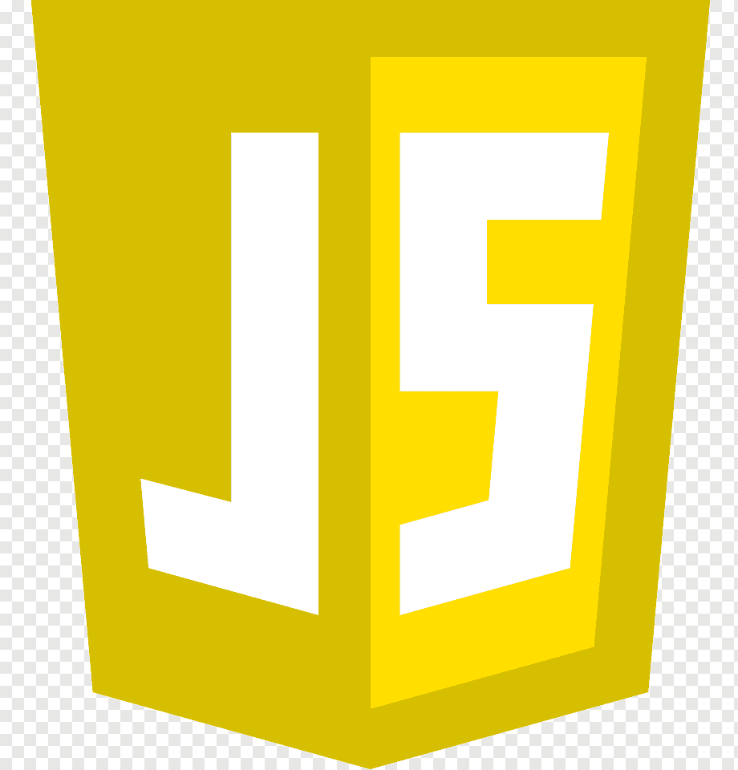
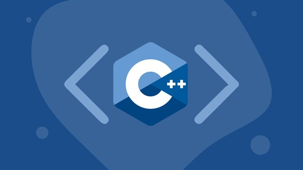

 **Fullstack** developer. **Currently working at Deloitte as a full-stack engineer/front-end lead**

☢️ 🌍 ~> ⛧ www.xavierelon.com ✨ 
USA 🇺🇸 Orlando, FL

 💬 Email me at <b>xavierelon93@gmail.com</b>

  

<h3> I am currently working on a startup: www.versusapp.io , an application that allows players to stake on video games. </h3>

 I am the lead engineer/architect building the microservices (Node, Express, Typescript, Deno, MongoDb), iPhone application (Swift), and website application (Next, Typescript, React) 

 You can find the repos on my Github here: 

  <ul>
    <li><a href="https://github.com/XavierElon/versus-microservice">Node/Express/MongoDb Microservice</a></li>
    <li><a href="https://github.com/XavierElon/versus-ui-starter-app">Next/React/Typescript Website</a></li>
    <li><a href="https://github.com/XavierElon/versus-deno-microservice">Deno/Typescript Microservice</a></li>
    <li><a href="https://github.com/XavierElon/versus-reusable-component-library">React/Typescript Reusable Component Library</a></li>
  </ul>
  

Languages, technology and frameworks I am well versed at: 
  

  
Tech I am currently learning:
  

  
Languages and tech I have previously used: 
  

