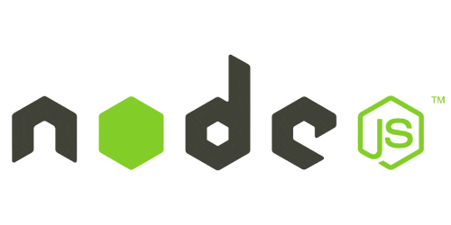

 **Fullstack** developer. **Currently working at Booz Allen as a Full-stack Staff Sotware Engineer**

☢️ 🌍 ~> ⛧ www.xavierelon.com ✨ 
USA 🇺🇸 Orlando, FL

View my resume at <a href="https://www.xavierelon.com/resume.pdf"> Resume</a>
 

 💬 Email me at <b>xavierelon93@gmail.com</b>

  

 I am currently the lead engineer/architect with 3 other engineer friends building the microservices (Node, Express, Typescript, Deno, MongoDb),  and website application (Next, Typescript, React) 

 You can find the repos on my Github here: 

  <ul>
    <li><a href="https://xsj-ui.vercel.app/">www.XSJ.com</a><a href="https://github.com/XavierElon/xsj-consulting-ui">  [Github Repo] (built with Next/React/Typescript/Tailwind)</a> </li>
    <li><a href="https://github.com/XavierElon/xsj-users-microservice">[Github Repo] (User Authentication Microservice built with Node/Express/MongoDb/Typescript</a></li>
    <li><a href="https://github.com/XavierElon/xsj-newsletter-microservice">[Github Repo] (Small Newsletter Microservice built with Node/Express/MongoDb/Typescript)</a></li>
<!--     <li><a href="https://github.com/XavierElon/xsj-ui-starter-app">Next/React/Typescript Website</a></li> -->
<!--     <li><a href="https://github.com/XavierElon/xsj-reusable-component-library">React/Next/Typescript Reusable Component Library</a></li> -->
<!--     <li><a href="https://github.com/XavierElon/xsj-deno-microservice">Deno/Typescript Microservice</a></li> -->
  </ul>

Languages, technology and frameworks I am well versed at: 
  

  
Tech I am currently learning:
  

  
Languages and tech I have previously used: 
  

