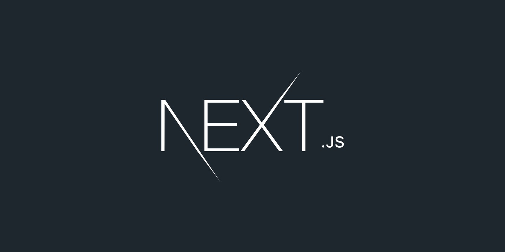

 **Fullstack** developer. **Currently working at Booz Allen as a Full-Stack Senior Sotware Engineer**

☢️ 🌍 ~> ⛧ www.xavierelon.com ✨ 
USA 🇺🇸

View my <a href="https://www.xavierelon.com/resume.pdf">resume</a> 
 Connect with me on <a href="https://www.linkedin.com/in/xavierelon/">LinkedIn</a>

 

View my <a href="https://xsj-ui.vercel.app/">Full-stack AI Chat App</a> 
 

 💬 Email me at <b>xavierelon93@gmail.com</b>

  

I am currently a student at Georgia Tech pursuing my masters in the <a href="https://omscs.gatech.edu/current-courses">OMSCS</a> specializing in AI and Machine Learning.

My Github Breakdown:
 

  

 

  

  

  

My WakaTime/Developer Stats:

  

My Leetcode stats:
 

  

 I am currently working on building microservices (Node, Express, Typescript, Deno, MongoDb) and a website application (Next, Typescript, React, Firebase, Firestore) that allows users to sign up/authenticate/authorize then chat with their friends or ChatGPT. It is a full stack application hosted on the Cloud.

 You can find the repos on my Github here: 

  <ul>
    <li><a href="https://xsj-ui.vercel.app/">www.XSJ.com</a><a href="https://github.com/XavierElon/xsj-consulting-ui">  [Github Repo] (built with Next/React/Typescript/Tailwind)</a> </li>
    <li><a href="https://github.com/XavierElon/xsj-users-microservice">[Github Repo] (User Authentication Microservice built with Node/Express/MongoDb/Typescript)</a></li>
    <li><a href="https://github.com/XavierElon/xsj-newsletter-microservice">[Github Repo] (Small Newsletter Microservice built with Node/Express/MongoDb/Typescript)</a></li>
<!--     <li><a href="https://github.com/XavierElon/xsj-ui-starter-app">Next/React/Typescript Website</a></li> -->
<!--     <li><a href="https://github.com/XavierElon/xsj-reusable-component-library">React/Next/Typescript Reusable Component Library</a></li> -->
<!--     <li><a href="https://github.com/XavierElon/xsj-deno-microservice">Deno/Typescript Microservice</a></li> -->
  </ul>

Languages, technology and frameworks I am well versed at: 
  

  
Tech I am currently learning:
  

  
Languages and tech I have previously used: 
  

<!--  -->

