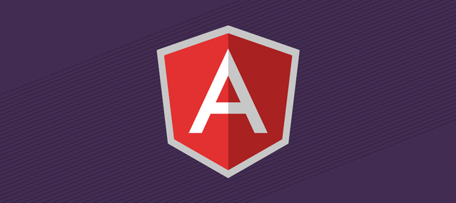

 **Fullstack** Software Engineer. **Actively looking for a new job in San Francisco at a startup or in tech**
 
 **Currently working at Booz Allen as a Full-Stack Senior Sotware Engineer**

 

  
    
 
   
 
  
   
 
 
   
 
 
   
 
 
   
 
 
  

☢️ 🌍 ~> ⛧ [www.xavierelon.com](https://xavierelon-portfolio.vercel.app/) ✨ 
USA 🇺🇸 San Francisco

  Visitors:
  

- 🌱 I’m currently learning **Machine Learning/Deep Learning** to become a Machine Learning Engineer

View my <a href="https://xavierelon.github.io/resume/resume.pdf">resume</a>

<h3 align="left">Connect with me:</h3>

 

 

View my <a href="https://xsj-ui.vercel.app/">Full-stack AI Chat App</a> 
 

 💬 Email me at <b>xavierelon93@gmail.com</b>

  

I am currently a student at Georgia Tech pursuing my masters in the <a href="https://omscs.gatech.edu/current-courses">OMSCS</a> specializing in AI and Machine Learning.

<h3 align="left">Languages:</h3>

  
  
  
  
  
  
  
  
  
  
  
  

<h3 align="left">Technologies, Tools and Frameworks:</h3>

  
  
  
  
  
  
  
  
  
  
  
  
  
  
  
  
  
  
  
  
  
  
  
  
  
  
  
  
  
  
  
  
  
  
  
  
  
  
  
  

I am currently building:

<ul>
    <li><a href="www.xavierelon.com">www.xavierelon.com</a>  <a href="https://github.com/XavierElon/xavierelon-portfolio">  [Github Repo] </a>(built with Next/React/Typescript/Tailwind)</li>
    <li><a href="xavierelon-v3.vercel.app">xavierelon-v3.vercel.app</a>     <a href="https://github.com/XavierElon/xavierelon-v3">  [Github Repo] </a>(built with Next/React/Typescript/Tailwind)</li>
</ul>

Some ML Projects I have built

<ul>
    <li><a href="https://github.com/XavierElon/ML-supervised-learning">[Github Repo]</a>Supervised Learning</li>
    <li><a href="https://github.com/XavierElon/ML-unsupervised-learning">[Github Repo]</a>Unsupervised Learning</li>
    <li><a href="https://github.com/XavierElon/ML-randomized-optimization">[Github Repo]</a>Ranomized Optimization</li>
</ul>

 I have previously built microservices (Node, Express, Typescript, Deno, MongoDb) and a website application (Next, Typescript, React, Firebase, Firestore) that allows users to sign up/authenticate/authorize then chat with their friends or ChatGPT. It is a full stack application hosted on the Cloud.

 You can find the repos on my Github here: 

  <ul>
    <li><a href="https://xsj-ui.vercel.app/">www.XSJ.com</a><a href="https://github.com/XavierElon/xsj-consulting-ui">  [Github Repo] (built with Next/React/Typescript/Tailwind)</a> </li>
    <li><a href="https://github.com/XavierElon/xsj-users-microservice">[Github Repo] (User Authentication Microservice built with Node/Express/MongoDb/Typescript)</a></li>
    <li><a href="https://github.com/XavierElon/xsj-newsletter-microservice">[Github Repo] (Small Newsletter Microservice built with Node/Express/MongoDb/Typescript)</a></li>
<!--     <li><a href="https://github.com/XavierElon/xsj-ui-starter-app">Next/React/Typescript Website</a></li> -->
<!--     <li><a href="https://github.com/XavierElon/xsj-reusable-component-library">React/Next/Typescript Reusable Component Library</a></li> -->
<!--     <li><a href="https://github.com/XavierElon/xsj-deno-microservice">Deno/Typescript Microservice</a></li> -->
  </ul>

My Github Breakdown:
 

  

 

  

  

  

My WakaTime/Developer Stats:

  

My Leetcode stats:
 

  

<!--
Languages, technology and frameworks I am well versed at: 
  

  
Tech I am currently learning:
  

-->

<!--
  
Languages and tech I have previously used: 
  

 -->
